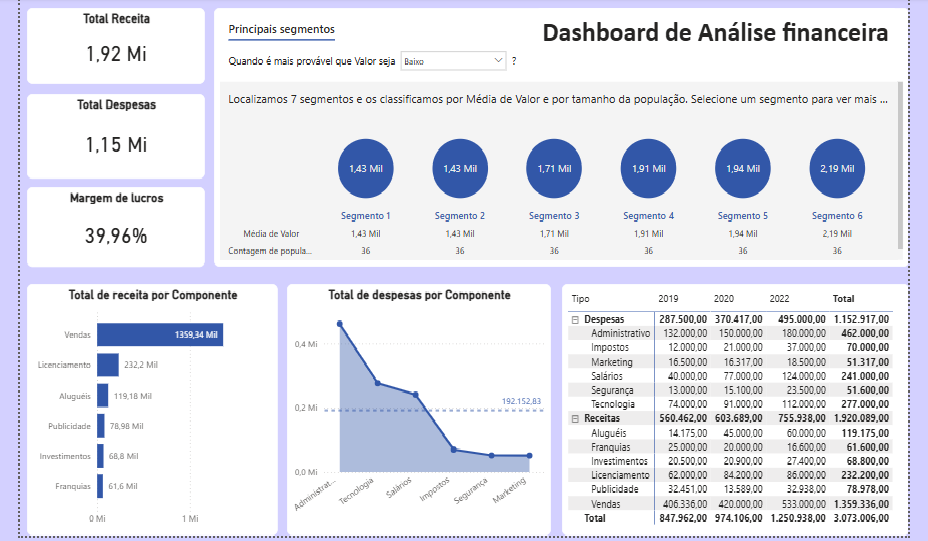

# 💰 Dashboard de Análise Financeira

## 📖 Sobre o projeto

Este projeto apresenta um dashboard de análise financeira desenvolvido no **Power BI Desktop**, com foco no acompanhamento de receitas, despesas e margem de lucro. O objetivo é fornecer uma visão consolidada dos principais indicadores financeiros da empresa, facilitando a análise de desempenho e apoiando a tomada de decisões estratégicas.

O relatório utiliza diferentes recursos do Power BI para transformar dados financeiros em informações visuais claras e interativas.

---

## 🎯 Objetivos

- Monitorar receitas e despesas da organização.
- Acompanhar a margem de lucro.
- Identificar os principais componentes responsáveis pelas receitas.
- Analisar a composição das despesas.
- Explorar segmentos com maior impacto financeiro.
- Consolidar informações financeiras por período.

---

## 📊 Funcionalidades do Dashboard

### 📌 Indicadores Financeiros (KPIs)

O painel apresenta os principais indicadores financeiros da empresa:

- 💵 Receita Total
- 💸 Despesa Total
- 📈 Margem de Lucro

Esses indicadores permitem uma visão rápida da saúde financeira do negócio.

---

### 🎯 Principais Segmentos

Utilização do recurso **Key Influencers (Principais Influenciadores)** para identificar os segmentos que apresentam maior impacto sobre os valores financeiros analisados.

A visualização auxilia na identificação de padrões e oportunidades de negócio.

---

### 📊 Receita por Componente

Análise da distribuição das receitas por categoria, permitindo identificar quais componentes representam maior participação no faturamento.

Exemplos de componentes analisados:

- Vendas
- Licenciamentos
- Aluguéis
- Publicidade
- Investimentos
- Franquias

---

### 📉 Despesas por Componente

Visualização da composição das despesas da empresa por categoria, facilitando a identificação dos principais centros de custo.

Entre eles:

- Administrativo
- Tecnologia
- Salários
- Impostos
- Segurança
- Marketing

---

### 📋 Demonstrativo Financeiro

Tabela consolidada contendo:

- Receitas
- Despesas
- Valores anuais
- Total geral

Permitindo análises comparativas entre períodos.

---

## 🛠️ Ferramentas Utilizadas

- Power BI Desktop
- Power Query
- DAX
- Modelagem de Dados
- Key Influencers
- KPIs
- Visualizações Interativas

---

## 📌 Indicadores Monitorados

- Receita Total
- Despesa Total
- Margem de Lucro
- Receita por Componente
- Despesa por Componente
- Resultado Financeiro
- Comparativo Anual

---

## 💡 Principais Insights

Este dashboard possibilita:

- Identificar as principais fontes de receita.
- Monitorar os maiores centros de custo.
- Avaliar a margem de lucro da organização.
- Comparar resultados financeiros ao longo dos anos.
- Apoiar decisões estratégicas por meio de indicadores financeiros.

---
## ⭐ Aprendizados

Durante o desenvolvimento deste projeto foram aplicados conceitos de:

- Modelagem de dados
- Construção de indicadores financeiros
- Criação de medidas em DAX
- Transformação de dados com Power Query
- Desenvolvimento de dashboards interativos
- Storytelling com dados

```

---

## 📷 Dashboard



---


---

## 🚀 Como visualizar

1. Faça o download do arquivo `.pbix`.
2. Abra o projeto utilizando o **Power BI Desktop**.
3. Explore os indicadores e interaja com os filtros disponíveis.

---

## 👨‍💻 Autor

**José Rafael Santos Pereira**

Analista de Dados | Power BI | SQL | Python | Flutter | Business Intelligence


GitHub: https://github.com/ZeRafaSp/

LinkedIn: https://www.linkedin.com/in/rafaelsantospereirarsp/

